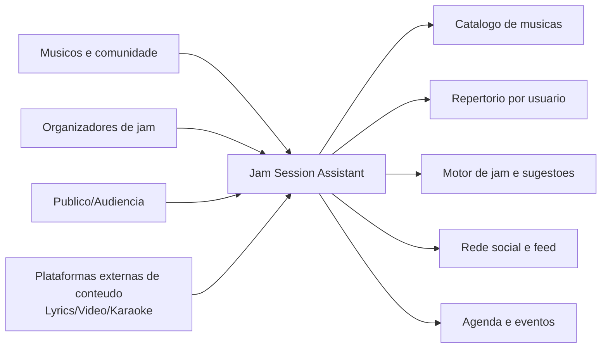

# 01. Business Context

## Objetivo de negocio

Reduzir o tempo de coordenacao antes da execucao musical, aumentar previsibilidade de sessao e sustentar continuidade da comunidade.

## Stakeholders

- Musico participante (core user)
- Organizador de jam / anfitriao
- Publico que solicita musicas
- Operacao de produto

## Contexto e fronteiras

## Proposta de valor

- Menos friccao para decidir o que tocar.
- Mais transparencia sobre quem sabe cada musica.
- Continuidade entre sessoes via feed, agenda e rede.
