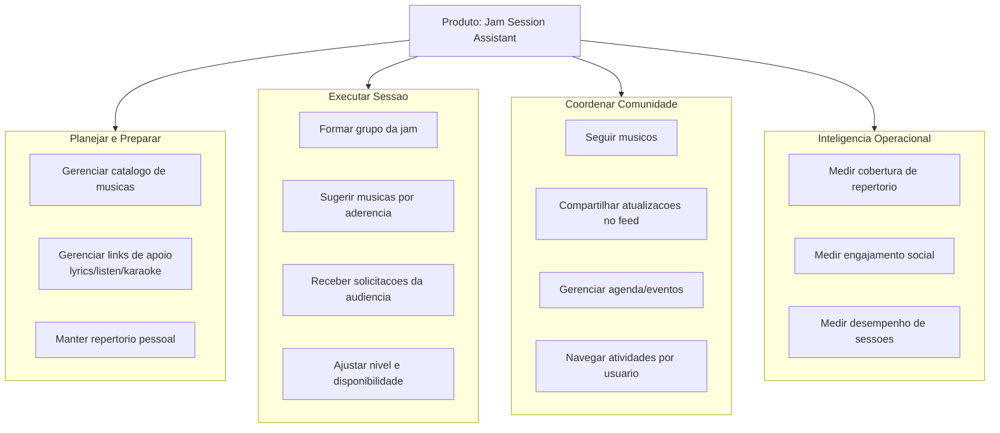

# 02. Capability Map

## Mapa de capacidades de negocio

## Priorizacao sugerida

1. Preparacao (`C1`) e execucao (`C2`) como capacidades core.
2. Comunidade (`C3`) como acelerador de rede.
3. Inteligencia (`C4`) para escalar governanca e melhoria continua.
