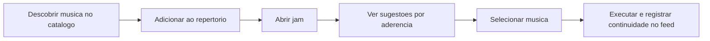
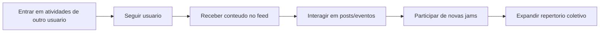
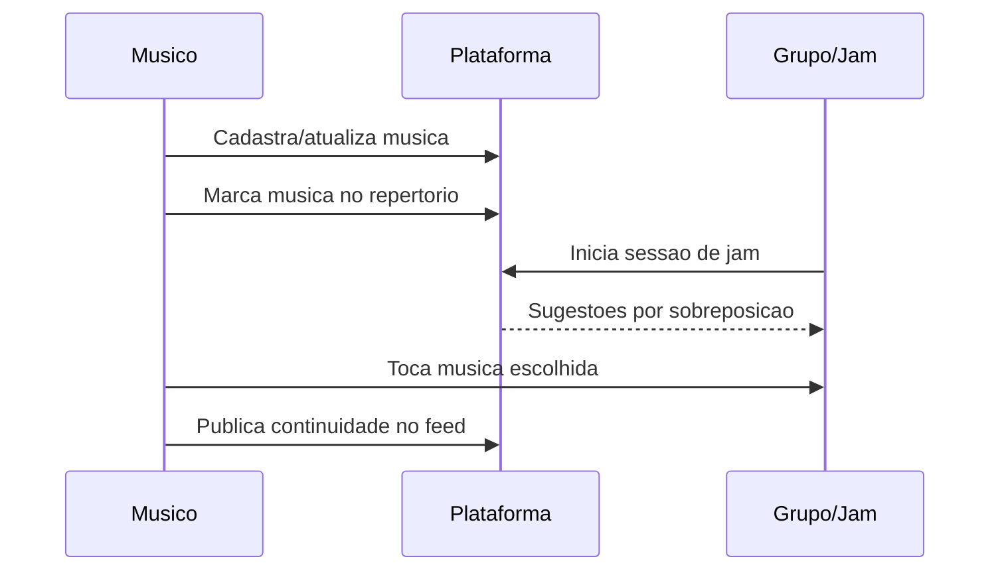

# 03. Value Streams

## Fluxo 1: da descoberta a execucao da musica

```mermaid
flowchart LR
  A[Descobrir musica no catalogo] --> B[Adicionar ao repertorio]
  B --> C[Abrir jam]
  C --> D[Ver sugestoes por aderencia]
  D --> E[Selecionar musica]
  E --> F[Executar e registrar continuidade no feed]
```

## Fluxo 2: crescimento de comunidade

```mermaid
flowchart LR
  A1[Entrar em atividades de outro usuario] --> B1[Seguir usuario]
  B1 --> C1[Receber conteudo no feed]
  C1 --> D1[Interagir em posts/eventos]
  D1 --> E1[Participar de novas jams]
  E1 --> F1[Expandir repertorio coletivo]
```

## Jornada resumida (swimlane)

```mermaid
sequenceDiagram
  participant M as Musico
  participant P as Plataforma
  participant G as Grupo/Jam

  M->>P: Cadastra/atualiza musica
  M->>P: Marca musica no repertorio
  G->>P: Inicia sessao de jam
  P-->>G: Sugestoes por sobreposicao
  M->>G: Toca musica escolhida
  M->>P: Publica continuidade no feed
```
