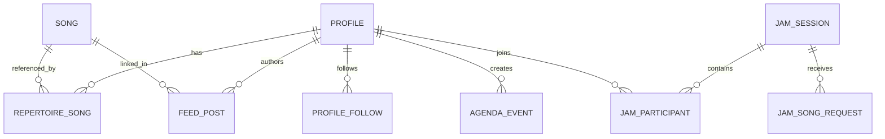

# 04. Domain and Information Architecture

## Entidades principais

## Regras de negocio relevantes

- `Repertoire_Song` representa capacidade declarada individual.
- Flag `Any song (full repertoire)` amplia elegibilidade no calculo de quem "sabe tocar".
- Feed e agenda preservam continuidade operacional entre sessoes.
- Rede de follows define alcance social e relevancia de descoberta.
