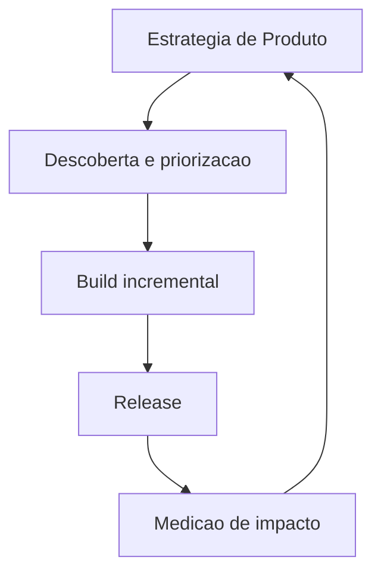
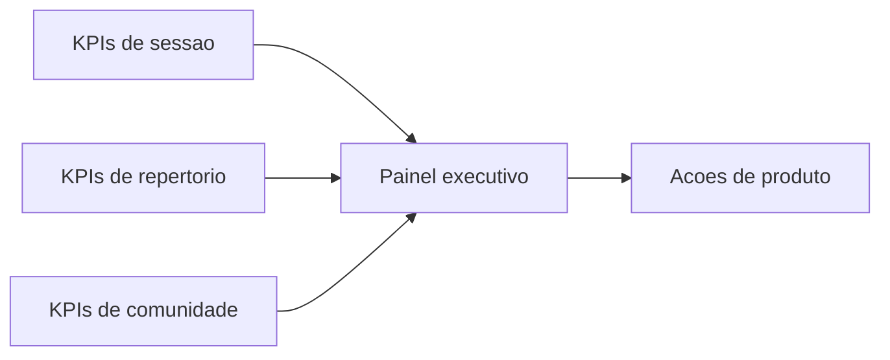

# 05. Operating Model and KPIs

## Modelo operacional (macro)

## KPIs recomendados

### Eficiencia de sessao

- Tempo medio ate primeira musica iniciar.
- Numero medio de musicas executadas por sessao.
- Taxa de match de sugestao (sugestao escolhida / sugestao exibida).

### Cobertura de repertorio

- Media de usuarios contabilizados por musica.
- Percentual de musicas sem nenhum usuario elegivel.
- Distribuicao por nivel (`ADVANCED` / `LEARNING`).

### Engajamento de comunidade

- Seguidores novos por semana.
- Posts e interacoes por sessao ativa.
- Eventos criados e confirmados no horizonte de 30 dias.

## Dashboard de acompanhamento (conceitual)

